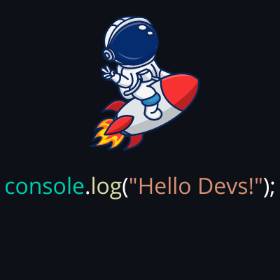

# Luan Rodrigues Pigosso.

 

 

☕ Habilidades: <strong>HTML, CSS, WordPress</strong>

 

📚 Estudando: <strong>JavaScript, Node.js, SQL, React</strong>

 

💼 Ferramentas: <strong>Vs Code, Figma, Canva, Trello, Vercel, Git e GitHub</strong>